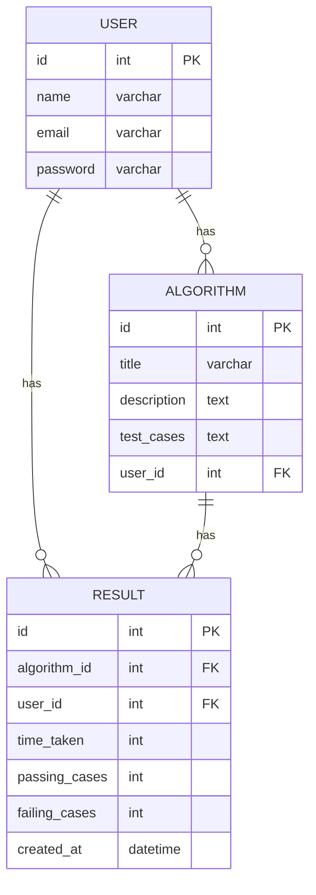

## Frontend Application Requirements

The frontend application should satisfy the following requirements:

1.  User Authentication
-   Allow users to login and logout from the application.
-   Handle user authentication and authorization.

2.  Algorithm List
-   Display a list of algorithms available to practice.
-   Display the average amount of time it takes the user to code and submit an algorithm for each algorithm in the list.
-   Allow the user to view the details of each algorithm, including its title, description, and associated test cases.
-   Allow the user to modify the description or test cases of an algorithm.

3.  Algorithm Editor
-   Allow the user to edit the code for an algorithm using the monaco editor component.
-   Display a sidebar with a timer and test cases.
-   Display a bottom panel below the editor for console output.

4.  Code Submission
-   Allow the user to submit their code solution for testing using the predefined test cases.
-   Display the results of the test run, including the number of passing and failing test cases, and the time it took to code the solution.

5.  User Profile

-   Allow the user to view and edit their profile information.

## Component Hierarchy
```
App
├── AuthPage
│   ├── LoginPage
│   └── SignupPage
├── HomePage
│   ├── AlgorithmListPage
│   │   ├── AlgorithmDetailsPage
│   │   └── AlgorithmEditorPage
│   └── ProfilePage
└── ErrorPage

```

-   `App`: the root component of the application that renders different pages based on the current route.
-   `AuthPage`: a page that handles user authentication and authorization. It contains the `LoginPage` and `SignupPage` components.
-   `HomePage`: the main page of the application that displays the algorithm list and the user profile. It contains the `AlgorithmListPage` and `ProfilePage` components.
-   `AlgorithmListPage`: a page that displays a list of algorithms available to practice. It contains the `AlgorithmDetailsPage` and `AlgorithmEditorPage` components.
-   `AlgorithmDetailsPage`: a page that displays the details of an algorithm, including its title, description, and associated test cases. It allows the user to modify the description or test cases of an algorithm.
-   `AlgorithmEditorPage`: a page that allows the user to edit the code for an algorithm using the `MonacoEditor` component. It displays a sidebar with a timer and test cases, and a bottom panel below the editor for console output.
-   `ProfilePage`: a page that allows the user to view and edit their profile information.
-   `ErrorPage`: a page that displays an error message when a route is not found or an error occurs during navigation.

## Application Routes
-   `/login`: displays the `LoginPage` component for user authentication.
-   `/signup`: displays the `SignupPage` component for user registration.
-   `/algorithms`: displays the `AlgorithmListPage` component that shows a list of algorithms available to practice.
-   `/algorithms/:id/details`: displays the `AlgorithmDetailsPage` component that shows the details of an algorithm identified by `:id`.
-   `/algorithms/:id/edit`: displays the `AlgorithmEditorPage` component that allows the user to edit the code for an algorithm identified by `:id`.
-   `/profile`: displays the `ProfilePage` component that shows the user's profile information.
-   `/error`: displays the `ErrorPage` component when a route is not found or an error occurs during navigation.

Note that the `AuthPage` and `HomePage` components do not have their own routes, as they are displayed conditionally based on the user's authentication status. If the user is not logged in, the `AuthPage` is displayed, otherwise the `HomePage` is displayed.

## API endpoints
-   `POST /login`: User login.
-   `GET /algorithms`: Get a list of algorithms.
-   `GET /algorithm/:id`: Get a specific algorithm.
-   `POST /algorithm`: Add a new algorithm.
-   `PUT /algorithm/:id`: Update an existing algorithm.
-   `DELETE /algorithm/:id`: Delete an algorithm.
-   `POST /submit/:id`: Submit a solution to an algorithm for testing.
-   `GET /user/:id`: Get a specific user.
-   `PUT /user/:id`: Update a user.

## Initial tickets
1.  Authentication and Authorization
-   Create a form component for login and handle form submission using `axios` library.
-   Create a form component for signup and handle form submission using `axios` library.
-   Implement a client-side token-based authentication system using `localStorage`.
-   Create a higher-order component for protected routes that checks the user's authentication status and redirects them to the login page if necessary.

2.  Algorithm List
-   Create a component to fetch and display the list of algorithms using the `axios` library.
-   Create a component to display the average amount of time it takes the user to code and submit an algorithm for each algorithm in the list.
-   Create a component for the algorithm details page that fetches and displays the details of a specific algorithm.
-   Create a component for the algorithm editor page that fetches the code for a specific algorithm and allows the user to edit the code using the `MonacoEditor` component.
-   Create a component for the timer and test cases sidebar.
-   Create a component for the console output panel.
-   Create a component for the code submission form that allows the user to submit their code solution for testing using the predefined test cases.
-   Create a component for the test results page that displays the results of the test run, including the number of passing and failing test cases, and the time it took to code the solution.
-   Implement a client-side caching mechanism to reduce the number of API calls when the user navigates between different pages.

1.  User Profile
-   Create a component for the profile page that fetches and displays the user's profile information.
-   Create a component for the profile editor form that allows the user to edit their profile information and handle form submission using `axios` library.

2.  Error Handling
-   Create a component for the error page that displays an error message when a route is not found or an error occurs during navigation.
-   Implement a client-side error handling mechanism using `axios` library to display error messages to the user when API requests fail.

3.  General
-   Set up routing using `react-router-dom` library to handle navigation between different pages.
-   Use `styled-components` library to create reusable styled components and styles for the application.
-   Write unit tests using `jest` and `react-testing-library` libraries to test the components' behavior and interactions.
-   Implement accessibility features such as keyboard navigation and ARIA attributes for improved accessibility.
-   Optimize the application's performance by using code splitting and lazy loading where applicable.

## Backend Application Requirements
The backend application should satisfy the following requirements:

1.  Algorithm Management
-   Allow authorized users to create, read, update, and delete algorithms.
-   Store algorithms in a MongoDB database.

2.  Code Execution and Testing
-   Execute code solutions submitted by users using AWS Lambda.
-   Test code solutions against predefined test cases.
-   Record the results of each test run, including the number of passing and failing test cases, and the time it took to code the solution.
-   Store the results of each test run in a MongoDB database.

3.  User Management
-   Allow authorized users to create, read, update, and delete user accounts.
-   Store user information in a MongoDB database.

4.  API
-   Expose a RESTful API to allow communication between the frontend and backend applications.
-   Handle requests for user authentication and authorization.
-   Handle requests for algorithm management.
-   Handle requests for code execution and testing.
-   Handle requests for user management.



### API Endpoints

-   User Authentication
    -   `POST /api/auth/login`: logs in a user
    -   `POST /api/auth/logout`: logs out the current user
-   Algorithm Management
    -   `GET /api/algorithms`: retrieves a list of all algorithms
    -   `GET /api/algorithms/:id`: retrieves details of a specific algorithm
    -   `POST /api/algorithms`: creates a new algorithm
    -   `PUT /api/algorithms/:id`: updates an existing algorithm
    -   `DELETE /api/algorithms/:id`: deletes an existing algorithm
-   Code Execution and Testing
    -   `POST /api/algorithms/:id/run`: runs a code solution against the predefined test cases
-   User Management
    -   `GET /api/users/:id`: retrieves details of a specific user
    -   `PUT /api/users/:id`: updates an existing user
    -   `DELETE /api/users/:id

## Available Scripts

In the project directory, you can run:

### `npm start`

Runs the app in the development mode.\
Open [http://localhost:3000](http://localhost:3000) to view it in the browser.

The page will reload if you make edits.\
You will also see any lint errors in the console.

### `npm test`

Launches the test runner in the interactive watch mode.\
See the section about [running tests](https://facebook.github.io/create-react-app/docs/running-tests) for more information.

### `npm run build`

Builds the app for production to the `build` folder.\
It correctly bundles React in production mode and optimizes the build for the best performance.

The build is minified and the filenames include the hashes.\
Your app is ready to be deployed!

See the section about [deployment](https://facebook.github.io/create-react-app/docs/deployment) for more information.

### `npm run eject`

**Note: this is a one-way operation. Once you `eject`, you can’t go back!**

If you aren’t satisfied with the build tool and configuration choices, you can `eject` at any time. This command will remove the single build dependency from your project.

Instead, it will copy all the configuration files and the transitive dependencies (webpack, Babel, ESLint, etc) right into your project so you have full control over them. All of the commands except `eject` will still work, but they will point to the copied scripts so you can tweak them. At this point you’re on your own.

You don’t have to ever use `eject`. The curated feature set is suitable for small and middle deployments, and you shouldn’t feel obligated to use this feature. However we understand that this tool wouldn’t be useful if you couldn’t customize it when you are ready for it.

## Learn More

You can learn more in the [Create React App documentation](https://facebook.github.io/create-react-app/docs/getting-started).

To learn React, check out the [React documentation](https://reactjs.org/).
